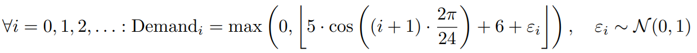

## Optimizing Inventory Management with Q-Learning and the (s,S) Policy
Inventory management is one of the most critical components of supply chain operations. From managing costs to handling fluctuating demand, businesses continuously search for strategies to optimize stock levels. In this article, we compare two approaches to inventory control — Q-Learning and the (s,S) Policy — with a Random Policy serving as a reference point for comparison.

### 1. Introduction
Efficient inventory management involves balancing stock levels to minimize costs while meeting demand. Traditional methods like the (s,S) Policy rely on fixed thresholds to determine when and how much to restock. On the other hand, modern approaches like Q-Learning leverage reinforcement learning to dynamically adapt decisions to observed demand patterns and restocking costs.

The objective of this analysis is to evaluate:

1. The dynamic adaptability of Q-Learning.
2. The performance of the traditional (s,S) Policy.
3. How these strategies compare against a Random Policy, used as a control.

### 2. Demand Patterns
The simulated demand data includes both a seasonal component and a random component. The seasonal component captures predictable fluctuations such as holidays or production cycles, while the random component accounts for unexpected demand shocks, reflecting real-world uncertainties.

