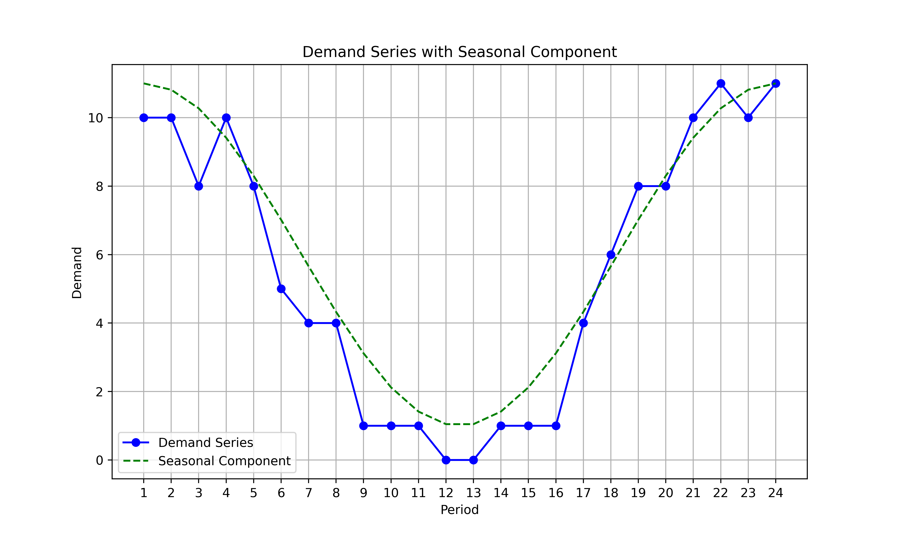
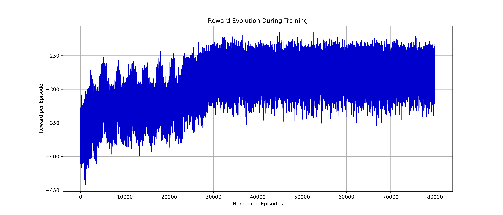
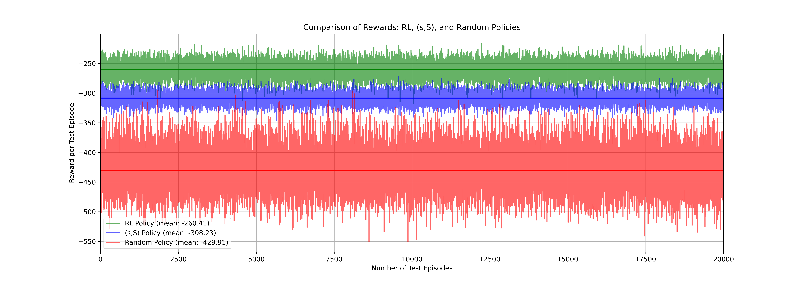

## Optimizing Inventory Management with Q-Learning and the (s,S) Policy
Inventory management is one of the most critical components of supply chain operations. From managing costs to handling fluctuating demand, businesses continuously search for strategies to optimize stock levels. In this article, we compare two approaches to inventory control — Q-Learning and the (s,S) Policy — with a Random Policy serving as a reference point for comparison.

### 1. Introduction
Efficient inventory management involves balancing stock levels to minimize costs while meeting demand. Traditional methods like the (s,S) Policy rely on fixed thresholds to determine when and how much to restock. On the other hand, modern approaches like Q-Learning leverage reinforcement learning to dynamically adapt decisions to observed demand patterns and restocking costs.

The objective of this analysis is to evaluate:

1. The dynamic adaptability of Q-Learning.
2. The performance of the traditional (s,S) Policy.
3. How these strategies compare against a Random Policy, used as a control.

### 2. Demand Patterns
The simulated demand data includes both a seasonal component and a random component. The seasonal component captures predictable fluctuations such as holidays or production cycles, while the random component accounts for unexpected demand shocks, reflecting real-world uncertainties.

The demand graph below illustrates the interplay of seasonal and random fluctuations:

### 3. The (s,S) Policy
The (s,S) policy is a widely used inventory control strategy, where restocking occurs whenever the inventory level falls below a lower threshold, s. When restocked, the stock is replenished up to an upper threshold, S.

Introduced in the mid-20th century, the (s,S) policy has remained a cornerstone of inventory management due to its simplicity and proven effectiveness in structured and predictable environments. Its rule-based framework makes it especially well-suited for scenarios where demand variability is low or moderately predictable.

However, this rigidity can become a limitation in dynamic contexts, where rapid demand fluctuations or supply chain disruptions necessitate more adaptive approaches.

The graph below illustrates the stock levels over time under the (s,S) policy:

 Example Graph")

The system triggers replenishment when inventory dips below the threshold s, restoring it to S at the start of the next period of time. This structured approach minimizes costs associated with stockouts and overstocking but may struggle to adjust dynamically to unforeseen demand patterns.

### 4. Q-Learning for Inventory Management
Q-Learning, a reinforcement learning algorithm, dynamically learns the optimal actions for restocking. By evaluating restocking costs, stockout penalties, and future demand, it adapts to minimize overall costs while handling fluctuations in demand. This algorithm represents a leap toward intelligent inventory systems, capable of adapting to ever-changing demand patterns. By learning from experience, it builds dynamic policies that go beyond static thresholds.

#### Training Convergence
The Q-Learning model was trained for 80,000 episodes. The graph below illustrates the evolution of rewards during training:

Over time, the algorithm learns to make decisions that consistently improve rewards, as seen by the upward trend.

### 5. Comparing Policies: Q-Learning, (s,S), and Random
After training the Q-Learning model, we tested it alongside the (s,S) policy and Random Policy across 20,000 episodes. The focus of this comparison is to evaluate:

- The flexibility and effectiveness of Q-Learning.
- The reliability of the traditional (s,S) policy.
- A Random Policy as a control.

### 6. Reward Comparison
The graph below compares the rewards achieved by each policy:

- Q-Learning (Green) outperforms other approaches with a mean reward of -260.41, showcasing its ability to dynamically adjust to demand.
- The (s,S) Policy (Blue) achieves a mean reward of -308.23, reflecting its reliability in structured inventory control.
- The Random Policy (Red) lags significantly, with a mean reward of -429.91, underscoring the value of structured decision-making.

Q-Learning’s adaptability enables it to minimize costs in environments with high variability. However, its computational demands and the need for extensive training episodes make it less suited for smaller-scale operations or highly predictable demand.

### 7. Conclusion
This experiment highlights the effectiveness of Q-Learning in inventory management, offering flexibility and adaptability in dynamic environments. While traditional methods like the (s,S) Policy remain reliable, reinforcement learning provides a modern alternative for optimizing supply chains.
